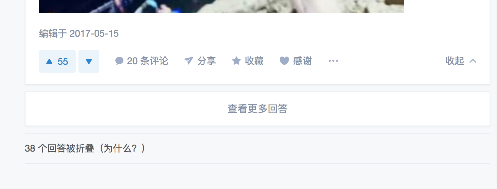
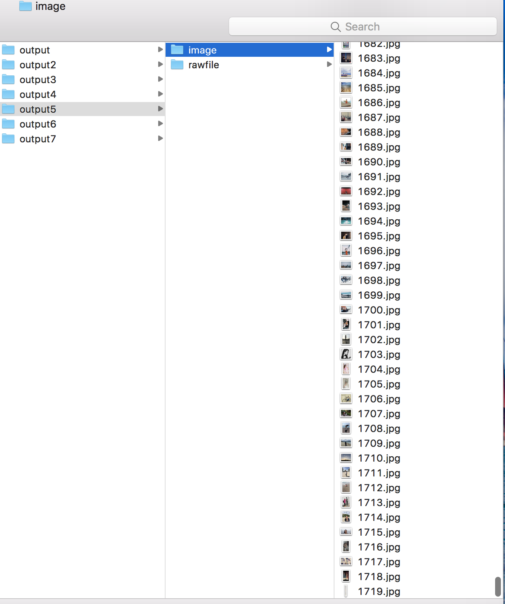
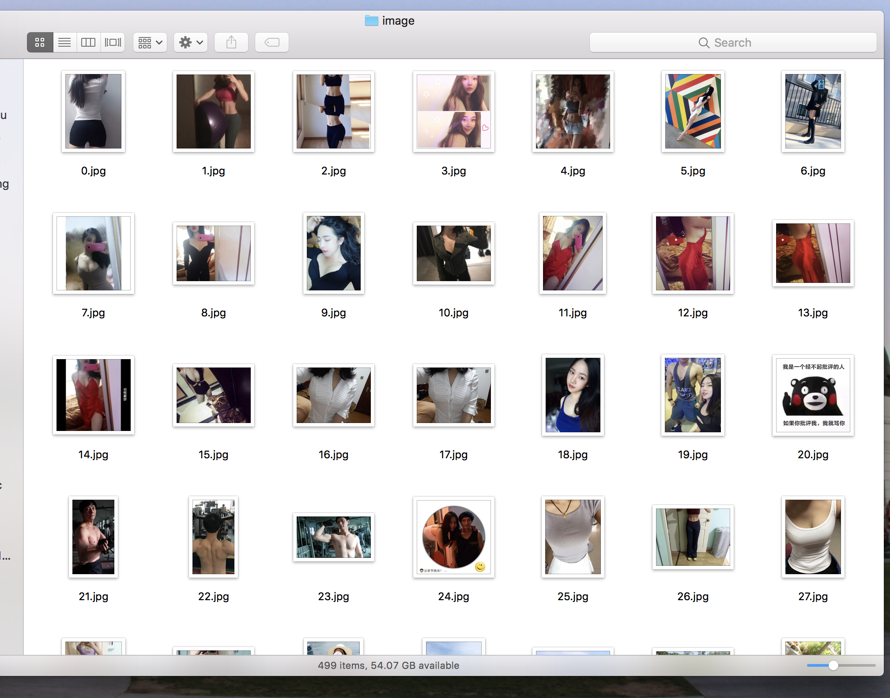

# 鼠标右键可以抠了，50行python爬虫代码，带你发现知乎新世界！

大哥：快看快看，这个小姐姐腿好长好白！

我：唉，知乎现在是世风日下，好好的问答社区，你说你们这些人怎么就喜欢看低俗的小黄图？你还是个女生！！！

大哥： 哇，手机内存不够了，用电脑保存小姐姐们的照片吧。

我：我说，你们看就看吧，还要一个个右键点开图片保存高清大图。。。

大哥：好麻烦啊，几百张图片我手都撸酸了，嘿嘿嘿。。。

我：什么？还想要偷懒？问我有没有简单的办法，可以一次性下载完所有图片？

大哥：双眼布灵布灵（可怜状）。。。

我：好吧，其实呢，我是不屑于看这些低俗的小黄图的。但既然你们这么求我，我就勉为其难地写个爬虫代码，满足一下你们饥渴的心灵。。。

----

**挑几张图，晒一下**


# Section 1 准备工作（Prerequirements)
1. 你以为第一件事情就是要学习知识，搭建环境么？当然不是，第一件事情当然是确立目标，睁大双眼，发现这个世界的美，嘿嘿嘿。。。我呢，给你们先列几个知乎问题链接，先点进去看看，你们肯定会回来努力学习的（微笑）。
  - 你的日常搭配是什么样子？[https://www.zhihu.com/question/35931586](https://www.zhihu.com/question/35931586)
  - 身材好是一种怎样的体验？[https://www.zhihu.com/question/26037846](https://www.zhihu.com/question/26037846)
  - 拍照时怎样摆姿势好看？[https://www.zhihu.com/question/19671417](https://www.zhihu.com/question/19671417)
  - 女性胸部过大会有哪些困扰与不便？[https://www.zhihu.com/question/20196263](https://www.zhihu.com/question/20196263)
  - 腿长是一种什么体验？[https://www.zhihu.com/question/28481779](https://www.zhihu.com/question/28481779)
  - 女生腿好看胸平是一种什么体验？[https://www.zhihu.com/question/61235373](https://www.zhihu.com/question/61235373)
  - 短发女孩要怎么拍照才性感？[https://www.zhihu.com/question/46458423](https://www.zhihu.com/question/46458423)

2. 首先，你要在电脑里安装 python 的环境，我会提供2.7和3.6两个版本的代码，但是本文只以python3.6版本为例。我建议不管是Win还是Mac用户，都最好下载一个 anaconda（[https://www.continuum.io/downloads](https://www.continuum.io/downloads)），用于管理python库和环境（[https://conda.io/docs/test-drive.html#managing-conda](https://conda.io/docs/test-drive.html#managing-conda)）。安装完成后，打开你电脑的终端（Terminal）执行以下命令：
```sh
# 搭建 python 3.6环境，爬虫专用。如果你已经装好了 python3.6的环境，那么可以跳过搭建环境这一步，直接安装所需要的 python库。
conda create --name crawler python=3.6

# 检查环境是否已创建
conda info --envs

# 激活python3.6环境
# Mac/Linux 用户
source activate crawler #激活
source deactivate #退出

# Win 用户
activate crawler # 激活
deactivate # 退出

# 检查 python 版本
python --version
```

3. 因为知乎网站前端是用 react 搭建的，页面内容随着用户鼠标滚轴滑动、点击依次展现，为了获取海量的图片内容，我们需要用 selenium（[https://pypi.python.org/pypi/selenium](https://pypi.python.org/pypi/selenium)） 这个 lib 模拟用户对浏览器进行滑动点击等操作。
```sh
# 利用 pip 安装 selenium
pip install -U selenium
```
下载安装完成后，我建议大家打开上面的链接，阅读一下 selenium 的使用方法,如下文。意思大致为,为了运行 selenium，我们需要安装一个 chrome 的 driver，下载完成后，对于 Mac 用户，直接把它复制到/usr/bin或者/usr/local/bin，当然你也可以自定义并添加路径。对于 Win 用户，也是同理。

```
Drivers

Selenium requires a driver to interface with the chosen browser. Firefox, for example, requires geckodriver, which needs to be installed before the below examples can be run. Make sure it’s in your PATH, e. g., place it in /usr/bin or /usr/local/bin.

Failure to observe this step will give you an error selenium.common.exceptions.WebDriverException: Message: ‘geckodriver’ executable needs to be in PATH.

Other supported browsers will have their own drivers available. Links to some of the more popular browser drivers follow.

Chrome:	https://sites.google.com/a/chromium.org/chromedriver/downloads
Edge:	https://developer.microsoft.com/en-us/microsoft-edge/tools/webdriver/
Firefox:	https://github.com/mozilla/geckodriver/releases
Safari:	https://webkit.org/blog/6900/webdriver-support-in-safari-10/

```


4. 在爬虫的时候我们经常会发现网页都是经过压缩去掉缩进和空格的，页面结构会很不清晰，这时候我们就需要用 beautifulSoup 这个 lib 来进行html 文件结构化
```sh
pip install beautifulsoup4
```


#  Section 2 代码解释

## 2.1 Import Libraries
```python

from selenium import webdriver
import time

import urllib.request

from bs4 import BeautifulSoup

import html.parser
```

## 2.2 确定目标URL
在 main 函数里边，打开chrome driver，然后输入 url
```python
def main():
    # *********  Open chrome driver and type the website that you want to view ***********************

    driver = webdriver.Chrome()   # 打开浏览器

    # 列出来你想要下载图片的网站

    # driver.get("https://www.zhihu.com/question/35931586") # 你的日常搭配是什么样子？
    # driver.get("https://www.zhihu.com/question/61235373") # 女生腿好看胸平是一种什么体验？
    # driver.get("https://www.zhihu.com/question/28481779") # 腿长是一种什么体验？
    # driver.get("https://www.zhihu.com/question/19671417") # 拍照时怎样摆姿势好看？
    # driver.get("https://www.zhihu.com/question/20196263") # 女性胸部过大会有哪些困扰与不便？
    # driver.get("https://www.zhihu.com/question/46458423") # 短发女孩要怎么拍照才性感？
    driver.get("https://www.zhihu.com/question/26037846") # 身材好是一种怎样的体验？

    ···

if __name__ == '__main__':
    main()
```

## 2.3 模拟滚动点击操作
在 main 函数里我们定义一个重复执行的函数，来进行滚动和点击的操作。首先我们可以用driver.execute_scrip来进行滚动操作。通过观察，我们发现知乎问题底部有一个“查看更多回答的”的按钮，如下图。因此我们可以用driver.find_element_by_css_selector来选中这个按钮，并点击。为了爱护小朋友们的身体，我们这里只爬取五个页面的图片。其实，五个页面，100个回答，往往都能有1000张图片了。。。




```python
# ****************** Scroll to the bottom, and click the "view more" button *********
    def execute_times(times):

        for i in range(times):
            driver.execute_script("window.scrollTo(0, document.body.scrollHeight);") # 滑动到浏览器底部
            time.sleep(2) # 等待页面加载
            try:
                driver.find_element_by_css_selector('button.QuestionMainAction').click() # 选中并点击页面底部的加载更多
                print("page" + str(i)) # 输出页面页数
                time.sleep(1) # 等待页面加载
            except:
                break

    execute_times(5) # 注意身体，五个页面够了的(微笑)

```

## 2.4 结构化 HTML 页面并保存

我们每次爬取页面信息，要做的第一件事就是把页面 HTML 存储下来。为了方便我们肉眼浏览，这时候就需要用beautifulSoup把压缩后的 HTML 文件结构化并保存。

```python
# ****************   Prettify the html file and store raw data file  *****************************************

result_raw = driver.page_source # 这是原网页 HTML 信息
result_soup = BeautifulSoup(result_raw, 'html.parser')

result_bf = result_soup.prettify() # 结构化原 HTML 文件

with open("./output/rawfile/raw_result.txt", 'w') as girls: # 存储路径里的文件夹需要事先创建。
    girls.write(result_bf)
girls.close()
print("Store raw data successfully!!!")
```

## 2.5 爬取知乎问题回答里的\nodes

要知道，在我们每次想要爬取页面信息之前，要做的第一件事就是观察，观察这个页面的结构，量身而裁。一般每个页面里都有很多个图片，比如在这个知乎页面里，有很多用户头像以及插入的图片。但是我们这里不想要用户头像，我们只想要要回答问题里的照片，所以不能够直接爬取所有 <\img\> 的照片。通过观察，我发现每一个图片附近都会有一个\<noscript\>的node，里边不仅有缩略图 URL 还有高清原图的 URL。因此，我为了偷懒，就直接把所有\<noscript\>给爬了下来。仔细观察，你会发现每个\<noscript\>的\<\>都是被 escape（HTML entity 转码）了的，所以要用html.parser.unescape进行解码。


```python
# ****************   Find all <nonscript> nodes and store them   *****************************************
with open("./output/rawfile/noscript_meta.txt", 'w') as noscript_meta: # 存储路径里的文件夹需要事先创建。
    noscript_nodes = result_soup.find_all('noscript') # 找到所有<noscript>node
    noscript_inner_all = ""
    for noscript in noscript_nodes:
        noscript_inner = noscript.get_text() # 获取<noscript>node内部内容
        noscript_inner_all += noscript_inner + "\n"

    noscript_all = html.parser.unescape(noscript_inner_all) #  将内部内容转码并存储
    noscript_meta.write(noscript_all)

noscript_meta.close()
print("Store noscript meta data successfully!!!")
```

转码后，结果如下(琳琅满目的高清无码大图 URL)：


## 2.6 下载图片
有了 img 的所有 node，下载图片就轻松多了。用一个 urllib.request.urlretrieve就全部搞定。这里我又做了一点清理，把所有的 url 单独存了一下，并用序号标记，你也可以不要这一步直接下载。

```python
# ****************   Store meta data of imgs  *****************************************
    img_soup = BeautifulSoup(noscript_all, 'html.parser')
    img_nodes = img_soup.find_all('img')
    with open("./output/rawfile/img_meta.txt", 'w') as img_meta:
        count = 0
        for img in img_nodes:
            if img.get('src') is not None:
                img_url = img.get('src')

                line = str(count) + "\t" + img_url  + "\n"
                img_meta.write(line)
                urllib.request.urlretrieve(img_url, "./output/image/" + str(count) + ".jpg") # 一个一个下载图片
                count += 1

    img_meta.close()
    print("Store meta data and images successfully!!!")
```

## 2.7 您好，您的小黄图大礼包已送达！

成功后，你后看到以下消息。然后你就可以躲在被窝里嘿嘿嘿了。。。





